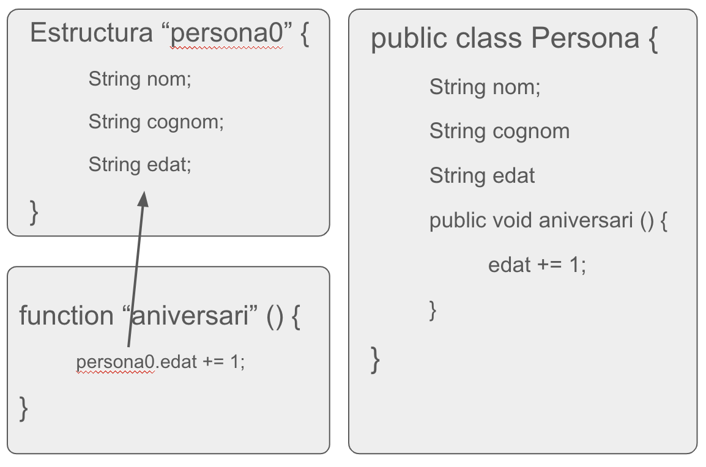

<div style="display: flex; width: 100%;">
    <div style="flex: 1; padding: 0px;">
        <p>© Albert Palacios Jiménez, 2024</p>
    </div>
    <div style="flex: 1; padding: 0px; text-align: right;">
        
    </div>
</div>
<br/>

# Introducció

## Patrons de disseny

Els **patrons de disseny** són solucions de programació usades habitualment al dissenyar software.

Habitualment els patrons de disseny es consideren bones pràctiques a la hora de programar.

A vegades es critica alguns patrons de disseny ja que poden ser resultat d’un mal disseny del software, en aquests casos s’anomenen ‘anti-patrons’

## Paradigmes de programació

Els diferents llenguatges de programació ofereixen diferents eines per solucionar els problemes que surten a la hora de dissenyar el software. En la programació imperativa hi ha dos paradigmes:

- **Programació procedural**, que agrupa les instruccions en procediments i les dades en estructures

- **Programació orientada en objectes**, en què les instruccions formen part de l’estat de l’objecte en què es declaren

<center>
<br/></center>
<br/>

### Orientació a objectes

És un paradigma en què la programació es fa definint objectes, que contenen dades i codi.

- **Dades**, o propietats de l’objecte
- **Codi**, procediments que operen sobre les dades (funcions)

Cal distingir entre les definicions i els objectes funcionals

- **Classes**, defineixen els objectes (les seves dades i funcions)
- **Instàncies**, objectes existents amb un estat (dades) diferents a altres objectes de la mateixa classe 

```java
// Classe
public class Poligon {
	int num_vertex = 1;
	String nom = “linia”
	public Poligon (v1, n1) {
	num_vertex = v1;
	nom = n1; }
}
// Instàncies
public static void Main (String[] args) {
	Poligon pL = new Poligon(2, “linia”);
	Poligon pT = new Poligon(3, “triangle”);
	Poligon pQ = new Poligon(4, “quadrat”);
}
```

L'orientació a Objectes ens permet fer servir **l'herència**, i sobre-escriure mètodes de les classes pare/filla.

```java
package SuperClass;
public class SuperClass {
   public int getNb() {
       return 1;
   }
   public int getNb2() {
   	return 2;
   }
}
package SuperClass;
public class SubClass extends SuperClass {
   @Override
   public int getNb2() {
   	return 3;
   }
}
```
```java
package SuperClass;
public class Main {
    public static void main(String args[]){
        SubClass s = new SubClass();
        System.out.println(s.getNb()); 
        //returns 1
        System.out.println(s.getNb2()); 
        //returns 3

        SuperClass sup = new SuperClass();
        System.out.println(sup.getNb()); 
        //returns 1
        System.out.println(sup.getNb2()); 
        //returns 2
    }
}
```

L'orientació a Objectes tembé permet definir **classes abstractes** amb mètodes buits, que s'han d'implementar segons necessitats.

```java
package Animals;
interface Animal {
   public void animalSound();
   public void sleep();
}
```
```java
package Animals;
class Anec implements Animal {
   public void animalSound() {
     System.out.println("L'anec fa: quac quac");
   }
}
```
```java
package Animals;
class Gos implements Animal {
   public void animalSound() {
     System.out.println("El gos diu: guau guau");
   }
   public void sleep() {
     System.out.println("Zzz");
   }
}
```
```java
package Animals;
public class Main {
   public static void main(String args[]){
       Anec a = new Anec();
       Gos g = new Gos();

       a.animalSound();
       g.animalSound();
   }
}
```

**Nota**: Les classes abstractes es declaren sense implementació, no es poden instanciar però se’n poden fer subclasses.
