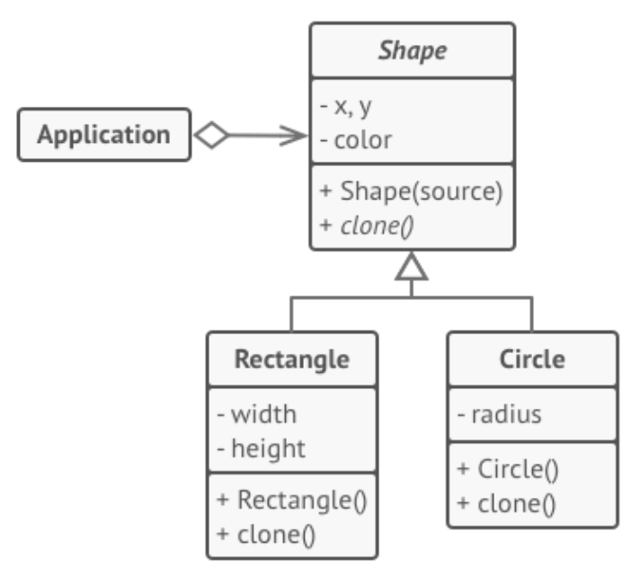

    

        
© Albert Palacios Jiménez, 2024

    

    

        
    

 

# Prototype

El patró de disseny **Prototype** ens permet crear còpies d’objectes sense dependre de les seves classes.

Quan volem una còpia exacte d’un objecte tenim algun problema:

- Els objectes poden tenir mètodes privats que no podem veure
- Com que cal conèixer la classe original, pot ser que implementi una altre classe

El patró **“prototype”** delega el procés de clonar un objecte als propis objectes que estan essent clonats.

Per fer-ho, es crea una “interficie” amb almenys el mètode **“clone”** que crea un objecte de la classe actual amb tots els valors de l’objecte antic

 

 

En l'exemple anterior, per implementar ‘shape’ és obligatori definir les funcions ‘clone’.

## Quan es fa servir Prototype

Quan el codi no hagi de dependre de les classes que necessites copiar

**Exemple**: Imagina que tens una clase complexa que és complicada de configurar, prototype permet tenir diferents objectes configurats llestos per clonar i usar

Més informació sobre [prototype](https://refactoring.guru/design-patterns/prototype) i un [exemple](https://refactoring.guru/design-patterns/prototype/java/example) en Java
