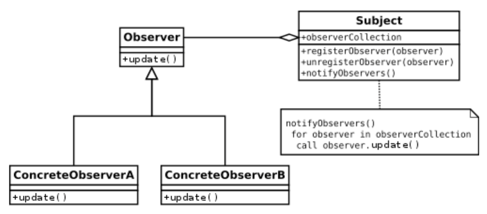

<div style="display: flex; width: 100%;">
    <div style="flex: 1; padding: 0px;">
        <p>© Albert Palacios Jiménez, 2024</p>
    </div>
    <div style="flex: 1; padding: 0px; text-align: right;">
        
    </div>
</div>
<br/>

# Observer

El patró de disseny **Observer** permet cridar a un mètode quan una variable cambia de valor. 

Tradicionalment un objecte, manté una llista d’observadors que criden a mètodes quan hi ha canvis a l’estat de l’objecte (valors de les variables).

No hi ha una manera específica d’implementar l’observer, alguns llenguatges l’implementen de base, altres tenen llibreries específiques i normalment el programador s’ho implementa com millor li convé.

## Usos més habituals

- En interfícies gràfiques quan un usuari canvia un ‘input’ (text, select, checkbox, …) per executar funcions que s'actualitzen les dades cap a una base de dades remota o algun altre element visual de la eina.

- Quan les dades canvien remotament i rebem els nous valors, aquests han d’actualitzar la interfície gràfica automàticament. O executar processos que tractin aquestes noves dades rebudes adeqüadament.

- Quan s’observa una carpeta d’arxius o un arxius i si hi ha canvis s’executa una acció (normalment ho fa un ‘thread’ paral·lel al procés)

**Exemple 'Simple' d'Observer**:

```java
// Definició de Observable
public abstract class Observable<T> {
   private T value;
   public Observable(T value) {
       this.value = value;
   }
   public T getValue() {
       return value;
   }
   public void setValue(T value) {
       T oldValue = this.value;
       this.value = value;
       this.propertyChange(oldValue, value);
   }
   public abstract void propertyChange(T oldValue, T newValue);
}
```
```java
// Ús d'Observable
Observable<Integer> obsNum = new Observable<Integer>(0) {
  @Override
  public void propertyChange(Integer oldValue, Integer newValue) {
    System.out.printf("obsNum ha canviat de %s cap a %s\n", 
                       oldValue, newValue);
  }
};
obsNum.setValue(1);
obsNum.setValue(2);
```

## Disseny

<center>
<br/></center>
<br/>

Cada variable que s’observa crida una funció **‘update’** al ser modificada (setter)

**Update** recorre una llista de funcions que cal executar quan una variable és modificada, executa totes les que observen aquella variable

Així <ins>cada variable pot executar diverses funcions</ins> al ser modificada

## Model tradicional

L’objecte ha d’acceptar l’observació de les variables, cada funció que es vol executar quan una variable observada canvia de valor s’ha de registrar amb:

**addPropertyChangeListener**, el nom de la variable i la funció a executar

```java
CotxeEvents cotxe = new CotxeEvents();

PropertyChangeListener l0 = new PropertyChangeListener() {
  @Override
  public void propertyChange(PropertyChangeEvent evt) {
    System.out.printf("L'estat s'ha canviat de %s cap a %s a través de la propietat '%s'\n",
        evt.getOldValue(), 
        evt.getNewValue(), 
        evt.getPropertyName());               
  }
};
cotxe.addPropertyChangeListener("estat", l0);
```

Per acceptar observació de variables, es defineix un objecte **PropertyChangeSupport** i les funcions que afegeixen/treuen funcions de la llista de crides a executar quan hi han canvis.

```java
private PropertyChangeSupport llistaObservers = new PropertyChangeSupport(this);

public void addPropertyChangeListener(String name, PropertyChangeListener listener) {
  llistaObservers.addPropertyChangeListener(name, listener);
}

public void removePropertyChangeListener(String name, PropertyChangeListener listener) {
  llistaObservers.removePropertyChangeListener(name, listener);
}
```

Quan un setter dels observats canvia el valor, ha d’informar a aquesta llista d’aquest esdeveniment amb **“.firePropertyChange”**:

```java
 public void setGasolina (int newValue) {
    int oldValue = this.gasolina;
    if (oldValue != this.gasolina) {
        this.gasolina = newValue;
        llistaObservers.firePropertyChange("gasolina", oldValue, newValue);
    }
}
```
