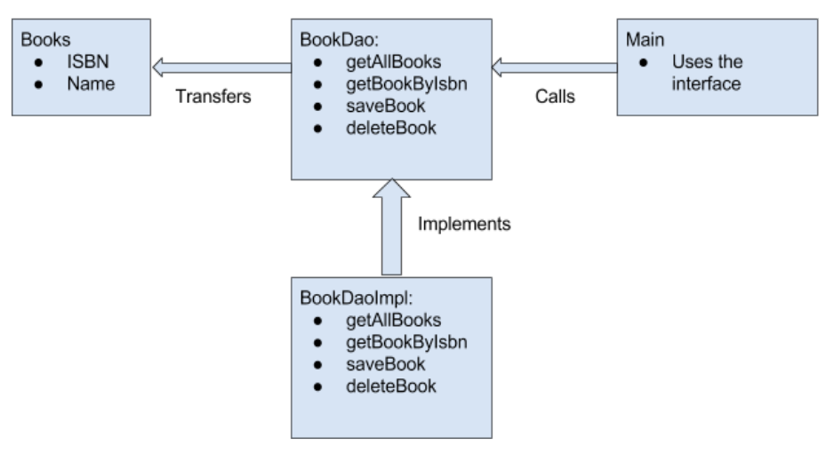

<div style="display: flex; width: 100%;">
    <div style="flex: 1; padding: 0px;">
        <p>© Albert Palacios Jiménez, 2024</p>
    </div>
    <div style="flex: 1; padding: 0px; text-align: right;">
        
    </div>
</div>
<br/>

# DAO - Data Access Object

**DAO** es fa servir per separar la manera de guardar les dades i la l’estructura lògica amb la que s’hi treballa a nivell de programació.

Una interfície base DAO defineix les funcions que implementen tots els objectes DAO

Cada objecte DAO implementa la transformació entre la seva Classe i on estan emmagatzemades les dades

<center>
<br/></center>
<br/>

Una manera habitual de definir quines funcions ha de implementar DAO és CRUD, que significa:

- Create
- Read
- Update
- Delete

I són les operacions més habituals al treballar amb models de dades

```java
public interface Dao<T> {

   void add(T t); // Equival a Create

   T get(int id); // Equival a Read
   ArrayList<T> getAll();

   void update(int id, T t);

   void delete(int id);
  
}
```

## Avantatges

- Simplifica el treball dels programadors al abstreure l’estructura de dades de l’arquitectura del programa

- Unifica la manera de fer les crides pels diferents tipus d’objectes independentment de com es guarden les seves dades

## Inconvenients

- A vegades es defineixen massa funcions DAO fent que sigui difícil de mantenir o impossible d’aplicar a totes les dades per igual

- Resta flexibilitat, fent que algunes crides/consultes a la base de dades no puguin estar optimitzades

- Separar la lògica de les dades pot implicar necessitar operacions “extra” per guardar les modificacions del model de dades

## Exemples

Els exemples mostren com ineractuar amb dades **.json** o **SQLite** a través de **DAO**