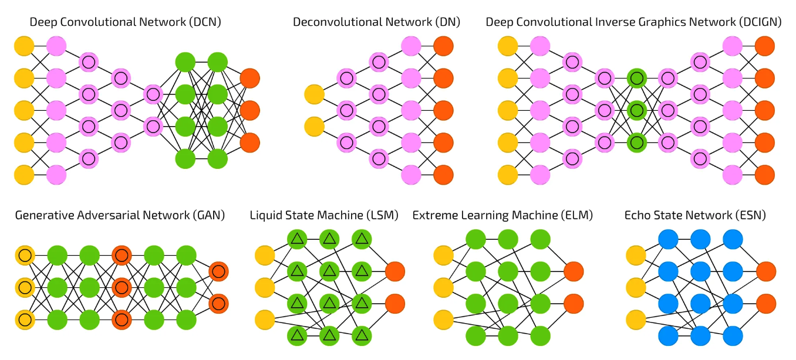

<div style="display: flex; width: 100%;">
    <div style="flex: 1; padding: 0px;">
        <p>© Albert Palacios Jiménez, 2024</p>
    </div>
    <div style="flex: 1; padding: 0px; text-align: right;">
        
    </div>
</div>
<br/>

# Introducció a la IA

## Xarxes Neuronals

Les **xarxes neuronals** estàn inspirades en el funcionament del cervell animal, i permeten automatitzar tasques de classificació i reconeixement de patrons.

Les **xarxes neuronals** estàn compostes per unitats anomenades **perceptrons** que representen les neurones, i es connecten entre si a través de pesos que determinen la influència d'una neurona sobre una altra.

<center>

<br/>
</center>
<br/>

Les **xarxes neuronals** es composen de:

- Una capa d'entrada (input)
- Una o diverses capes ocultes (hidden)
- Una capa de sortida (output)

Cada una de les capes que formen la xarxa, pot tenir una o diverses neurones.

Hi ha molts tipus de xarxes, segons la seva funció:

<center>

<br/>
</center>
<br/>

[Imatge amb tipus de xarxes neurals](./assets/typesofnetworks.webp)

Quan volem fer tasques de programació amb xarxes neurals, hem de definir quines capes tindrà la nostra xarxa. 

Per les tasques més comuns ja hi ha xarxes estàndard, com per exemple:

- **ResNet18** que és un tipus de xarxa preparada per classificar imatges
- **BERT** que és un tipus de xarxa preparada per treballar amb text
- **GPT** capaç de generar text
- ...

### PyTorch

PyTorch és una biblioteca de codi obert per a l'aprenentatge automàtic i la computació científica, que proporciona eines per construir i entrenar xarxes neuronals.

<center>

<br/>
</center>
<br/>


**PyTorch** és coneguda per la seva facilitat d'ús, flexibilitat i suport per a càlculs en GPU, permetent així desenvolupar models complexos de manera eficient.

Per instal·lar **PyTorch**:
```bash
pip install torch torchvision torchaudio Pillow tqdm
```

O bé a macOS amb *brew*:
```bash
python3 -m pip install torch torchvision torchaudio Pillow tqdm --break-system-package
```

Com que **PyTorch** pot fer servir l'acceleració gràfica, cal llibreries extra per activar-la:
```bash
# NVIDIA
# Cuda: https://developer.nvidia.com/cuda-downloads
# cuDNN: https://developer.nvidia.com/cudnn
pip install torch torchvision torchaudio Pillow tqdm --extra-index-url https://download.pytorch.org/whl/cu118
# ARM
# https://rocmdocs.amd.com/en/latest/Installation_Guide/Installation-Guide.html
pip install torch torchvision torchaudio Pillow tqdm --extra-index-url https://download.pytorch.org/whl/rocm5.4.2
```

Podeu provar si teniu les llibreries PyTorch i l'acceleració a través de GPU activada amb l'script Python:

```bash
./ai_utilCheck.py
# O bé, python ./ai_utilCheck.py
```

<br/><br/>

# Classificació binària

La **classificació binària** és un tipus de problema d'aprenentatge automàtic on un model assigna una de dues etiquetes possibles a cada entrada. Per exemple:

- Classificar un correu electrònic com a "spam" o "no spam"
- Identificar si una imatge conté un objecte específic (com un gat) o no.

Farem la classificació binària en dues fases:

- **Train** (entrenament), en aquesta fase mostrem molts exemples dels dos tipus que volem classificar per entrenar la xarxa
- **Classify** (classificació), fer servir la xarxa entrenada per classificar nous objectes a partir del què la xarxa ha après dels exemples durant l'entrenament

Hem d'organitzar les dades per poder fer aquestes dues fases:

<center>

<br/>
</center>
<br/>

- L'arxiu **"./data/training.zip"**, un cop descomprimit genera la carpeta **"./data/training"** que conté les dades amb les que entrenarem la xarxa.

    Com que és una classificació binària només pot tenir 2 carpetes, una amb exemples que compleixen la classificació i una altre amb exemples que **no** compleixen la classificació.

    A l'**"Exemple 0"** hi ha la carpeta *'cat'* amb fotos de gats i la carpeta *non_cat* amb fotos d'animals que no són gats.

- L'arxiu **"./data/testing.zip"**, un cop descomprimit genera la carpeta **"./data/testing"** que té imatges aleatòries que compleixen i no compleixen la condició, per poder testejar la xarxa entrenada.

    A l'**"Exemple 0"** hi ha imatges aleatòries d'animals que són gats i d'altres animals.

Igualment, a l'**"Exemple 0"**, tenim dos programes **Python**:

- **"ai_train.py"** entrena una xarxa neural amb les dades de **"./data/training.zip"**

- **"ai_classify.py"** fa servir la xarxa entrenada per classificar nous exemples, en aquest cas els exemples de **"./data/testing.zip"**

**Important:** L'arxiu d'entrenament **"ai_train.py"** genera dos arxius:

- **"iscat_config.json"** que conté la configuració de la xarxa i és necessari per poder-la fer servir per classificar

- **"iscat_model.pth"** que conté la xarxa entrenada durant la fase d'entrenament, i és l'encarregada de classificar noves fotos

**Nota**: Les dades es guarden en un **.zip** per no tenir centenars d'arxius al projecte.

# Paràmetres

Cal entendre aquests conceptes:

- **Device**: és el dispositiu que farà les operacions matemàtiques, si diu (GPU accelerated) anirà més ràpid.

- **Model**: és el model de la xarxa entrenada, que farem servir per predir noves imatges (o textos, ...)

- **Accuracy**: és la fiabilitat de la xarxa, és a dir el % de vegades que dóna una resposta correcta. A més pròxim a 100% millor.

- **Epoch**: és cada vegada que es repeteix un entrenament/validació de l'entrenament

- **Millor model**: cada Epoch genera un nou model que es valida, si és el millor que hem trobat el guardem

- **Early stopping**: Comparació per deixar d'entrenar la xarxa si veiem que ja no millora o que està empitjorant

- **Patience**: Cops que repetim un Epoch sense millorar abans de provocar l'**early stopping**

- **Image size**: Mida a la que s'entrenen les imatges, que és prou gran com per fer un bon entrenament però prou petita com perquè l'entrenament vagi ràpid i no trigui hores

Paràmetres més específics:

- **Batch size**: significa el número de vegades que processa mostres abans d'actualitzar els pessos de les neurones

- **Learning rate**: valor amb el que es modifiquen els pesos per intentar millorar el model, segons si hem encertat o fallat la predicció (un valor 0.0001 vol dir que es modifiquen molt poc)

- **Validation split**: defineix quina part de les dades es dedica a entrenament i quina a validació. 0.2 vol dir que un 20% del total de dades disponibles es dedicarà a validar l'entrenament per decidir si la xarxa de l'últim EPOCH és millor o pitjor que la que hem guardat com a millor.

## Entrenament amb PyTorch

Per entrenar una xarxa amb PyTorch seguim els següents passos:

- Preparar les dades (descomprimir l'arxiu .zip)
- Preparar el model 
    En el cas d'imatges de l'exemple fem servir **ResNet18**
    Definim la sortida com a binària amb **Sigmoid**
- Guardar la configuració del model per poder-la llegir al fer la classificació en un arxiu **".json"**
- Definim que cada EPOCH d'entrenament tindrà dues fases
    **Entrenament** escull dades aleatories per entrenar
    **Validació** valida el nou model amb dades aleatòries
    Això permet descartar el model si és pitjor que el de l'anterior EPOCH
- Carregar les dades 
    Ho fem amb els **loaders** per optimitzar l'entrenament
    Definim una mida d'imatges a entrenar
    Diem que les imatges s'agafin en un ordre aleatori
    Diem quantes mostres s'han d'agafar en cada bloc d'entrenament
    Igual per les mostres de validació ...
- Definir 'early stopping' que permet aturar l'entrenament si veu que jan o millora o inclús empitjora
- Definir què fa cada 'EPOCH', bàsicament fer l'entrenament
- Definir com es valida cada 'EPOCH', passar mostres a la última xarxa entrenada per veure si té més encerts que la millor trobada (i si té més encerts definir-la com a millor xarxa)
- Acabar l'entrenament guardant la millor xarxa de totes les entrenades a cada EPOCH en un arxiu **".pth"**
- Esborrar la carpeta d'entrenament

## Classificació amb PyTorch

Per classificar objectes en una xarxa entrenada amb PyTorch:

- Si n'hi ha, descomprimir les dades a classificar
- Crear el model fent servir la configuració d'entrenament
- Definir les transformacions perquè coincideixin amb les de l'entrenament
- Carregar el model de l'arxiu **".pth"** que farà la classificació
- Evaluar les dades a classificar segons el model