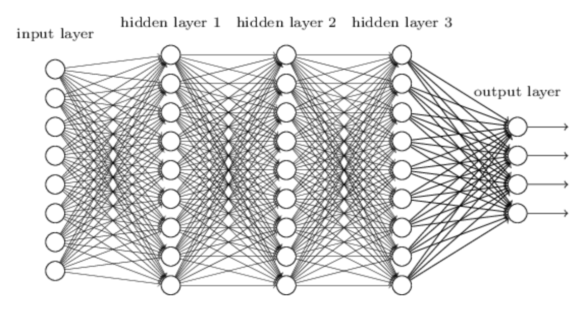
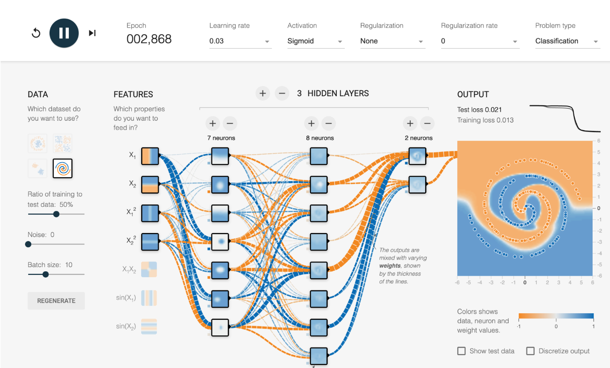

<div style="display: flex; width: 100%;">
    <div style="flex: 1; padding: 0px;">
        <p>© Albert Palacios Jiménez, 2024</p>
    </div>
    <div style="flex: 1; padding: 0px; text-align: right;">
        
    </div>
</div>
<br/>

# Xarxes neuronals

Les **xarxes neuronals** és un sistema informàtic inspirat en el cervell humà. Així com el cervell està format per milions de neurones que treballen juntes per processar informació, una xarxa neuronal té moltes unitats petites anomenades **perceptrons** que treballen junts per resoldre problemes.

Les **xarxes neuronals** s'organitzen en capes:

- **Capa d'entrada**: és la primera capa i rep les dades inicials (com una imatge, text o nombres).

- **Capes ocultes (o denses)**: aquestes capes processen la informació. Cada neurona de la capa oculta pren les dades de la capa anterior, fa alguns càlculs, i les passa a la següent capa. Com més capes ocultes té una xarxa, més complexos són els patrons que pot reconèixer.

- **Capa de sortida**: és l'última capa que dona el resultat final (per exemple, dir si una imatge mostra un gos o un gat).

<center>

<br/>
</center>
<br/>

## Entrenament:

Les xarxes neuronals aprenen veient molts exemples.

Si volem que una xarxa aprengui a reconèixer gossos, li ensenyarem moltes fotos de gossos i li direm: "això és un gos". Amb cada exemple, la xarxa ajusta els seus càlculs per millorar.

Aquest procés d'ajust es diu **entrenament**, i es basa en corregir els errors que la xarxa fa fins que aprèn a donar la resposta correcta.

## Funcions d'activació:

Les **funcions d'activació** defineixen com s'activen les neurones a partir de l'entrada rebuda.

En un **perceptró la funció d'activació és lineal** perquè només s'activa si les dades rebudes són >=0.

Però segons el tipus de dades que analitzem necessitem altres tipus de funcions:

- **Funció Lineal (Identitat)**

    Simplement retorna el valor d'entrada tal com és.

    Útil en perceptrons simples i algunes capes de sortida.

- **Sigmoide**

    Converteix qualsevol valor en un rang entre 0 i 1, ideal per a sortides binàries.

- **ReLU (Rectified Linear Unit)**

    Retorna 0 si l'entrada és negativa, i el mateix valor si és positiu. Això permet que la xarxa aprengui amb més eficiència en tasques complexes.

    És molt popular en xarxes profundes.

- **Tangència Hiperbòlica (tanh)**

    Similar a la sigmoide però amb una sortida entre -1 i 1. 
    
    Pot ser útil quan les dades tenen valors negatius i positius.

<br/>
<center>

<br/>
</center>
<br/>

Aquest exemple online permet veure l'efecte de les diferents funcions d'activació:

- [Tensofrflow playground](https://playground.tensorflow.org/)

<center>

<br/>
</center>
<br/>

## Llibreria DL4J

La llibreria **deeplearnin4j** permet configurar xarxes neurals de manera senzilla amb Java.

## Exemple 0

Aquest exemple configura una d'xarxa d'una sola capa oculta amb dos perceptrons, un per l'entrada i un altre per la sortida fent servir **DL4J**.

Fes anar l'exemple amb:
```bash
./run.sh com.Project.Main
```

Codi:

```java
MultiLayerConfiguration config = new NeuralNetConfiguration.Builder()
    // Per iniciar els pesos 'weights' aleatòriament
    .seed(123) 
    // Algorisme d'aprenentatge 'train' (Sgd = Stochastic Gradient Descent)
    .updater(new Sgd(0.1))  
    // Activar diverses capes amb 'list' (per poder fer múltiples 'layers')
    .list()
    .layer(0, new DenseLayer.Builder()
        .nIn(4)  // 4 entrades
        .nOut(1) // 1 neurona de sortida
        .activation(Activation.SIGMOID) // funció d'activació
        .build())
    .layer(1, new OutputLayer.Builder(LossFunctions.LossFunction.XENT)
        .nIn(1)  // 1 entrada de la capa anterior
        .nOut(1) // 1 sortida: 0 per parell, 1 per senar
        .activation(Activation.SIGMOID) // funció d'activació
        .build())
    // Construir una xarxa segons la configuració anterior
    .build();

// Inicialitzar la xarxa (segons config)
MultiLayerNetwork model = new MultiLayerNetwork(config);
model.init();
}
```

Entrena el model a partir d'un conjunt de dades d'entrenament. Dades d'entrada i les sortides esperades per aquestes entrades:

```java
// Entrades en binari per a 4 bits (0000 = 0, 0001 = 1, etc.)
INDArray input = Nd4j.create(new double[][]{
    {0, 0, 0, 0}, // 0 (parell)
    {0, 0, 0, 1}, // 1 (senar)
    {0, 0, 1, 0}, // 2 (parell)
    {0, 0, 1, 1}, // 3 (senar)
    {0, 1, 0, 0}, // 4 (parell)
    {0, 1, 0, 1}, // 5 (senar)
    {0, 1, 1, 0}, // 6 (parell)
    {0, 1, 1, 1}  // 7 (senar)
});

// Sortides corresponents a les entrades anteriors (0 per parell, 1 per senar)
INDArray output = Nd4j.create(new double[][]{
    {0}, // Parell
    {1}, // Senar
    {0}, // Parell
    {1}, // Senar
    {0}, // Parell
    {1}, // Senar
    {0}, // Parell
    {1}  // Senar
});

// Dades amb les que treballa la xarxa (entrada/sortida)
DataSet dataSet = new DataSet(input, output);

// Entrenar el model
for (int epoch = 0; epoch < EPOCHS; epoch++) {
    model.fit(dataSet);
}
```

Finalment executa la xarxa entrenada, enviant peticions i observant la resposta:
```java
INDArray testInput = Nd4j.create(new double[]{0, 1, 1, 0}).reshape(1, 4); 
INDArray outputPrediction = model.output(testInput);

double result = outputPrediction.getDouble(0);
System.out.println("Resultat de la predicció (0=parell, 1=senar): " + result);
System.out.println(result < 0.5 ? "Parell" : "Senar");
```

## Exemple 1

Aquest exemple configura una d'xarxa per classificar imatges de persones somrient (smile) o sense somriure (non_smile) amb **DL4J**.

Entrena la xarxa amb:

```bash
./run.sh com.train.Main
```

Aleshores es crea un arxiu **trained_model.zip** que conté la xarxa entrenada, i es pot fer servir des d'altres aplicacions.

Classifica imatges:

```bash
./run.sh com.classify.Main
```

**Entrenament**

Cada carpeta dins de "data/train" representa una possible classificació, en aquest cas cares amb somriure "smile" i cares sense somriure "non_smile".

Les imatges s'han de preparar per poder ser classificades en igualtat de condicions, en concret:

- La mida de la imatge d'entrenament (64x64)
- Si és una imatge de color o en blanc i negre (3 canals o 1 canal)

Un cop preparades les imatges, ja es pot generar la **xarxa neuronal** que s'ha d'entrenar.

### Configuració de les capes

La llibreria **DL4J** permet afegir capes 'extra' a la xarxa neural, per millorar la predicció:

- **Convolution Layer (5x5)**

    Aquesta capa aplica **filtres convolucionals de 5x5** per extreure característiques de la imatge d'entrada. Els filtres recorren la imatge identificant patrons com vores, textures o formes simples.

    Amb **32 filtres** definits (`nOut(32)`), es generen **32 mapes de característiques**, cadascun representant una resposta diferent a una característica detectada en la imatge.

    La funció d'activació **ReLU** (`Activation.RELU`) ajuda a introduir no-linealitats, eliminant valors negatius per millorar l'aprenentatge dels patrons.

- **Subsampling Layer (Max Pooling 2x2)**

    Aquesta capa redueix la mida espacial dels mapes de característiques mitjançant **max-pooling**, que selecciona el valor màxim dins d'una finestra de 2x2 i es mou amb un desplaçament de 2. 

    Això redueix les dimensions dels mapes de característiques a la meitat, **ajudant a reduir la complexitat computacional** i fent que la xarxa sigui menys sensible a petits desplaçaments en la imatge d'entrada.

- **Convolution Layer (5x5)**

    Una **segona capa convolucional** amb **64 filtres** de 5x5 (`nOut(64)`) que continua l'extracció de característiques, però amb un nombre més gran de filtres per captar característiques més complexes i detallades de la imatge.

    Igual que abans, utilitza **ReLU** per introduir no-linealitats.

- **Subsampling Layer (Max Pooling 2x2)**

    Una altra capa de **max-pooling** que torna a reduir la mida dels mapes de característiques utilitzant una finestra de 2x2 i un desplaçament de 2.

    Això ajuda a **resumir les característiques** extretes, reduint la mida i evitant sobreajustament.

- **Dense Layer**

    Aquesta capa està completament connectada a les sortides de les capes anteriors, permetent que cada neurona vegi tota la informació de les característiques extretes.

    Amb **128 neurones** (`nOut(128)`), pot aprendre combinacions de característiques per a tasques més complexes.

    Utilitza **ReLU** per ajudar a captar relacions no lineals.

- **Output Layer**

    Aquesta és la capa final que **produirà la classificació**. Té **`nOut(NUM_CLASSES)`** neurones, una per cada possible classe de sortida.


    Utilitza la funció d'activació **Softmax** (`Activation.SOFTMAX`) per convertir les sortides en probabilitats, de manera que la xarxa pugui assignar una probabilitat a cada classe.

    La funció de pèrdua **Negative Log-Likelihood** (`LossFunctions.LossFunction.NEGATIVELOGLIKELIHOOD`) s'utilitza per optimitzar el model durant l'entrenament.

- **Configuració d'Entrada**

    **`setInputType`** estableix que la xarxa espera **entrades convolucionals** amb altura, amplada i canals específics (`HEIGHT`, `WIDTH`, `CHANNELS`). Això garanteix que la xarxa entengui com processar les dades d'entrada correctament.

- **Construcció de la Xarxa**

    La configuració final es **construeix** amb `.build()`, que agrega totes les capes definides i les opcions a la xarxa completa, llesta per entrenar-se o utilitzar-se per inferència.

```java
MultiLayerConfiguration conf = new NeuralNetConfiguration.Builder()
    // Defineix una llavor per a la inicialització aleatòria dels pesos per garantir resultats reproduïbles
    .seed(123)
    //Algorisme d'aprenentatge 'train' (Adam amb un ritme de 0.001)
    .updater(new Adam(0.001))
    // Comença la configuració de la llista de capes de la xarxa
    .list()
    // Afegeix una capa convolucional amb filtres de 5x5
    .layer(new ConvolutionLayer.Builder(5, 5)
        .nIn(CHANNELS) // Defineix el nombre de canals d'entrada (1 per tons de gris, 3 per RGB)
        .stride(1, 1)  // Estableix el desplaçament de la convolució a 1 (sense saltar píxels)
        .nOut(32)      // Defineix 32 filtres, cada un generant una sortida diferent
        .activation(Activation.RELU) // Utilitza ReLU com a funció d'activació
        .build())
    // Afegeix una capa de subsampling amb tipus de pooling màxim (max-pooling)
    .layer(new SubsamplingLayer.Builder(SubsamplingLayer.PoolingType.MAX)
        .kernelSize(2, 2) // Utilitza una finestra de 2x2 per al pooling
        .stride(2, 2) // Desplaçament de 2, redueix la mida de les sortides a la meitat
        .build())
    // Afegeix una segona capa convolucional amb filtres de 5x5
    .layer(new ConvolutionLayer.Builder(5, 5)
        .nOut(64) // Defineix 64 filtres per a aquesta capa
        .stride(1, 1) // Estableix el desplaçament de la convolució a 1
        .activation(Activation.RELU) // Utilitza ReLU com a funció d'activació
        .build())
    // Afegeix una altra capa de subsampling amb max-pooling
    .layer(new SubsamplingLayer.Builder(SubsamplingLayer.PoolingType.MAX)
        .kernelSize(2, 2) // Finestra de 2x2 per al pooling
        .stride(2, 2) // Desplaçament de 2 per reduir la mida
        .build())
    // Afegeix una capa densa totalment connectada amb 128 neurones
    .layer(new DenseLayer.Builder()
        .nOut(128) // Defineix 128 neurones en aquesta capa
        .activation(Activation.RELU) // Utilitza ReLU com a funció d'activació
        .build())
    // Afegeix la capa de sortida per a classificació
    .layer(new OutputLayer.Builder(LossFunctions.LossFunction.NEGATIVELOGLIKELIHOOD)
        .nOut(NUM_CLASSES) // Defineix el nombre de classes de sortida (per exemple, 2 per binària)
        .activation(Activation.SOFTMAX) // Utilitza Softmax per a classificació multi-classe
        .build())
    // Estableix el tipus d'entrada esperat per la xarxa (convolucional amb altura, amplada, canals)
    .setInputType(org.deeplearning4j.nn.conf.inputs.InputType.convolutional(HEIGHT, WIDTH, CHANNELS))
    // Construeix la configuració completa de la xarxa
    .build();

MultiLayerNetwork model = new MultiLayerNetwork(conf);
model.init();
model.setListeners(new ScoreIterationListener(10));
```

Un cop iniciada la **xarxa neuronal** ja es pot entrenar el model.

```java
for (int epoch = 0; epoch < EPOCHS; epoch++) {
    System.out.println("Epoch " + (epoch + 1) + " / " + EPOCHS);
    model.fit(trainIter);
}
```

Durant l'entrenament es veuen la següent informació:

- **Epoch**: és un cicle complet d'entrenament de la xarxa neuronal sobre tot el conjunt de dades d'entrenament. En altres paraules, és el moment en què el model ha processat totes les mostres del conjunt d'entrenament una vegada.

    Si tens, per exemple, 1000 mostres d'entrenament, una epoch significa que el model ha passat per les 1000 mostres una vegada.

- **Iteració**: es refereix a una actualització dels paràmetres del model (com els pesos i biaixos) després de processar un batch (lot) de mostres.

    El batch size és el nombre de mostres processades a cada iteració. Per exemple, si el conjunt d'entrenament té 1000 mostres i el batch size és 100, necessitaràs 10 iteracions per completar una epoch (1000 / 100 = 10).

    Així doncs, el nombre d'iteracions per epoch depèn del batch size i del nombre total de mostres del conjunt d'entrenament.

- **Score**: és una mesura del rendiment del model en cada iteració, indicant quantitat de pèrdua (loss) que té el model després d'aquella iteració.

    En aquest context, el score és una mesura de la funció de pèrdua que el model intenta minimitzar durant l'entrenament. 
    
    **Valors de score més baixos** indiquen un millor rendiment, ja que la pèrdua és menor.

Un cop entrenat el model, ja es pot guardar en un arxiu per fer-lo servir més tard en altres aplicacions.

```java
model.save(new File("trained_model.zip"), true);
System.out.println("Model entrenat i guardat com a 'trained_model.zip'");
```